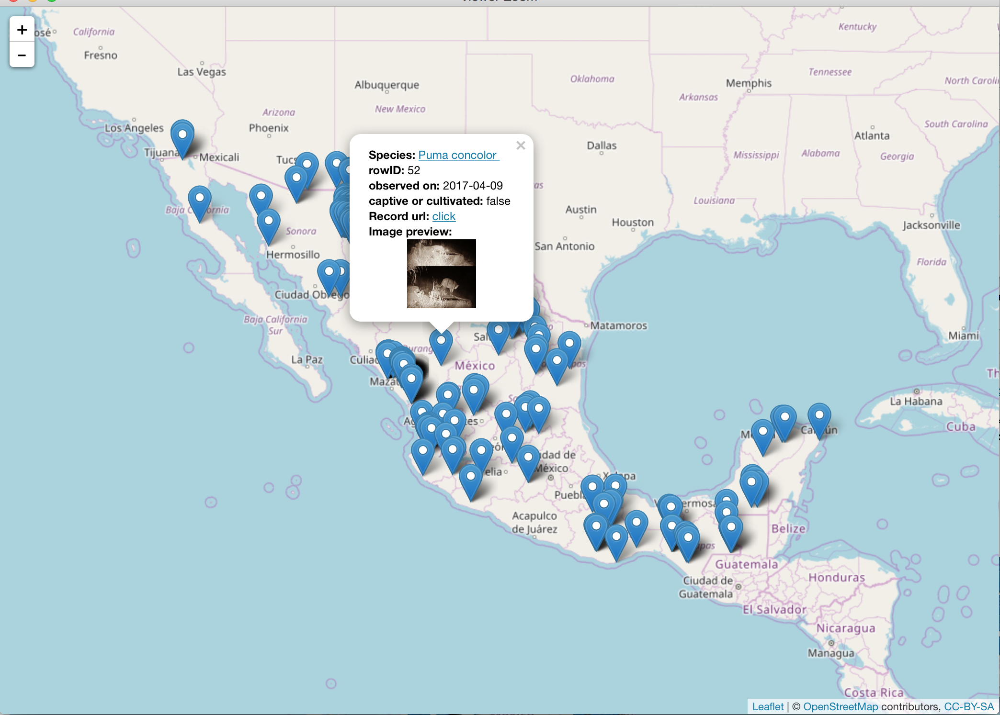

## naturalr

Access [naturalista](http://www.naturalista.mx/) data from Mexico through APIs.

## Install

Install the development version using `install_github` within Hadley's [devtools](https://github.com/hadley/devtools) package.

```r
install.packages("devtools")
require(devtools)

install_github("luismurao/naturalr")
```
## Usage

```r
library(naturalr)
```
Look for cougar records in Mexico that are not from captivity sites.
```r
puma_occs <- get_inat_obs(query = "Puma concolor",
                          geo = T,maxresults = 1000,
                          captive_cultivated = F)
```
Plot a leaflet map that displays basic information like species description and naturalita photos.

``` r
inat_map(puma_occs,imgPreview=T)
```

<a href="https://luismurao.github.io/puma_example.html" target="_blank"><div style='text-align: center;'></div></a>


## Acknowledgments

Special thanks to Dirección General de Proyectos Interinstitucionales [CONABIO](http://www.conabio.gob.mx/). We also thank to [SEMARNAT](https://www.gob.mx/semarnat), [CONANP](https://www.gob.mx/conanp), [FMCN](https://fmcn.org/), [MOORE](https://www.moore.org/), [PNUD](http://www.mx.undp.org/), [GEF](https://www.thegef.org/), [RESILIENCIA](http://resilienciamexico.com/), [c6](http://www.c6.org.mx/), [FGM](https://www.facebook.com/Fondo-Golfo-de-M%C3%A9xico-AC-257470674443404/), [Cooperación Alemana](https://www.alemania-mexico.com/patrocinadores/la-cooperacion-alemana-en-mexico/), [GIZ](https://www.giz.de/en/worldwide/33041.html), [INECOL](http://www.inecol.mx/inecol/index.php/es/), [ROBIN](https://twitter.com/robin_project), [UNAM](https://www.unam.mx/),[IB-UNAM](http://www.ib.unam.mx/),
[USAID](https://www.usaid.gov/es/mexico),[U.S. FOREST SERVICE](https://www.fs.fed.us/), [INIFAP](http://www.inifap.gob.mx/SitePages/Inicio.aspx).

 


